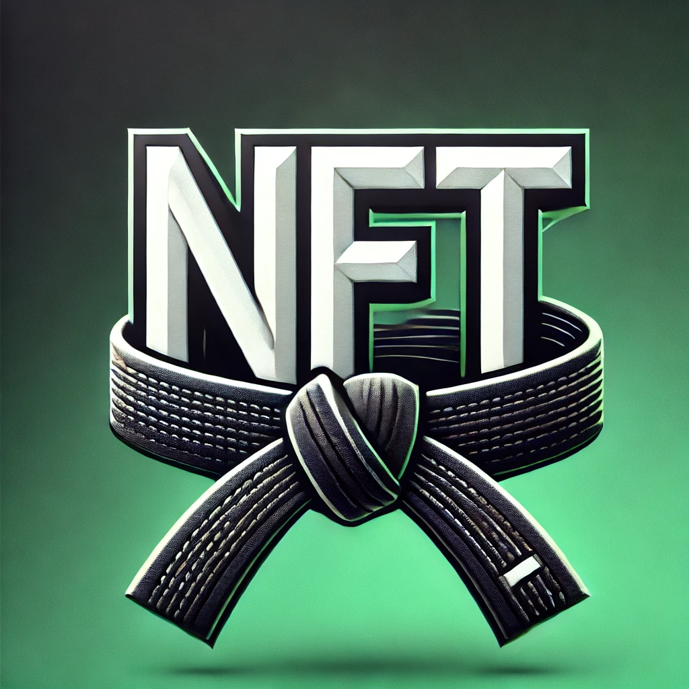

# dojonft
A NFT generator for Marital Arts Schools (and anyone else!)

It's easy to run the tool locally, just clone the repo and run 

```
npm install
```
and then 

```
npm start
```



# Welcome to Dojo NFT!

If I give you one dollar, and you give me back one dollar, we are **EXACTLY** even, because every dollar is exactly the same as every other. This property is called being _fungible_.

**Non-Fungible Tokens (NFTs)**, on the other hand, represent anything unique. For instance, you cannot switch one student's belt rank certificate with that of another student. The properties that make belt certificates non-fungible include the name, date, and rank.

NFTs have been taking the world by storm, and unlock tremendous possibilities, but also require coding skills where the market demand currently far outstrips the supply. Thus, I have created this tool to allow martial arts schools (and others) to be able to create their own NFT collections and badges with absolutely no coding required.

Potential use cases for NFTs include issuing verifiable **rank certificates**, issuing badges to people who attended certain **events**, someone who is the **demo team captain**, instructor or **student of the month**, **full splits club**, **25 gold medal club**, promotional materials, **"Founding Member, new location"**, coupons that cannot be forged/reused, etc.

---

## How Does it Work?

Although you can view this site on mobile, this is a tool designed for desktop browsers.

There are three main items. Each school will organize all of their NFTs in a **Collection**. Each collection will have several **Badges**. Then, each of those badges can be used to mint individual **Tokens**. For example:

| **Collection**          | **Badges**                                  | **Tokens (NFTs)**                                      |
|--------------------------|---------------------------------------------|-------------------------------------------------------|
| **Name:** Cobra Cai Dojo | Badge 1 - All Valley Tournament Competitor  | Token 0 - Johnny Lawrence Badge-1                     |
| **Symbol:** COB          | Badge 2 - All Valley Tournament Champion   | Token 1 - Miguel Diaz Badge-1                         |
|                          | Badge 3 - December 1984 Perfect Attendance | Token 2 - Johnny Lawrence Badge-2                     |
|                          | Badge 4 - 1st Dan Black Belt               | Token 3 - Johnny Lawrence Badge-2                     |
|                          | Badge 5 - 2 Weeks Free Classes             | Token 4 - Miguel Diaz Badge-2                         |
|                          |                                             | Token 5 - Johnny Lawrence Badge-3                     |
|                          |                                             | Token 6 - Johnny Lawrence Badge-4                     |
|                          |                                             | Token 7 - Jane Smith Badge-5                          |

You don’t have to keep track of token IDs; they will increment automatically. One badge can be awarded multiple times to the same person, as Lawrence won the **All Valley Tournament** in 82 and 83. 

Here is some more information about each item type:

---

### **Collection**
- A collection has an **owner** (the initial creator) who can create and change badges as well as add and remove staff and award tokens. 
- Staff are optional, and they can create badges and award tokens (NFTs).

---

### **Badges**
- A badge has an **image or animation** as well as a **title**.
- You may include any other attributes for a badge that you wish.

---

### **Tokens (NFTs)**
- A token has an **owner**, an **ID** (automatically assigned), and a **badge type** that it is set when created.
- It then inherits the image, title, and other attributes from its badge type.

## What are the fees?

Rather than use this tool to make a for-profit company, I decided to release it as a free and open-source public good. The only fees you will pay will be the fees for the blockchain to mint and store your NFTs. However, if you want to show your appreciation, I do accept donations (and cool NFTs!) at **dojonft.eth**.

As of 1/2021, creating a new collection costs about 25 cents, adding badges about 6 cents, and issuing NFTs about 2 cents each.

---

## What can my students do with their NFTs?

They **really own them**, and can do with them whatever they wish, including trading them on Opensea, transferring them to friends, fractionalizing them, burning them, taking out a loan against them, etc. Who knows? This space moves faster than any one person can keep up with.

Because these NFTs follow the **ERC721 standard**, they will automatically be displayed in compatible wallets, marketplaces, games, metaverse worlds, etc.

---

## Are NFTs bad for the environment?

This debate has come up because Ethereum is currently using **Proof of Work** until around June 2022. However, the NFTs generated by this tool are on **Polygon**, an environmentally friendly and inexpensive Ethereum sidechain.

---

## What do I need to get started?

- You will need a desktop computer and the **Metamask** wallet [https://www.metamask.io](https://www.metamask.io), which is a browser extension for Chrome and other browsers. Make sure your Metamask account is connected to **Polygon**.
- You will also need a way to **pin images** to the Interplanetary File System (IPFS). An easy and free way is to get an account at [https://www.pinata.cloud](https://www.pinata.cloud).
- Finally, you will need **maybe $5 worth of Matic tokens** on the Polygon network. If you have an account with Crypto.com, you can buy this with a credit card and then withdraw the tokens to your Metamask address. *(Make sure to withdraw to the Polygon network.)*

---

## What do my students need to get started?

Your students only need to provide you with their Ethereum address. They do **NOT** need to fund the address with anything. They do not need any account on any exchange, credit card, ID documents, etc.

- They can just create the account for free in Metamask. 
- It’s also recommended for privacy purposes that students create a **new address** only for collecting NFTs from your school. For instance, if someone was the 'Student of the Month' and used their regular address, then others would be able to know their transaction history or balance.
- They will only need to put some Matic in their address if they ever want to transfer the NFT or sell it.

---

## What is the rarity of each token and is the total supply limited?

As the owner of the collection, **you (and staff you designate)** are 100% responsible for determining this. The only NFTs that can exist in the collection are those you issue. Similarly, there is no maximum supply of tokens.

- Keep in mind that you could also create multiple collections if you think that this will help with organization or value. 
- For instance, one collection for promotional NFTs like **'2 weeks free'**, one collection for **'rank certifications'**, one for **'event attendance'**, etc.

---

## I like most of this but I want to change something

The code is open source and free for you to use for any purpose! Fork the project and make your own improvements. 

I am also happy to accept pull requests if you make the project better in any way.

---

## What if something goes wrong? ##
This tool is made to be easy to use, but you are still using cutting-edge technology. The following steps can help solve most issues:

1. If you are having trouble loading something, try refreshing the browser.

2. Make sure you are logged in to metamask and connected to the site. Make sure metamask is connected to Polygon. There should be a green 'logged in' button with the first few digits of your address in the upper right corner

3. Metamask will usually choose the correct gas price. However, it's possible that if there is a surge of activity right before you mint, your transactions may take a while to go through. You can wait or click 'speed up.' To see the current gas prices on Polygon, check out this Gas Tracker.

4. You can open the browser console to see helpful debug messages

5. If you still have any problems, please open an issue on github.
